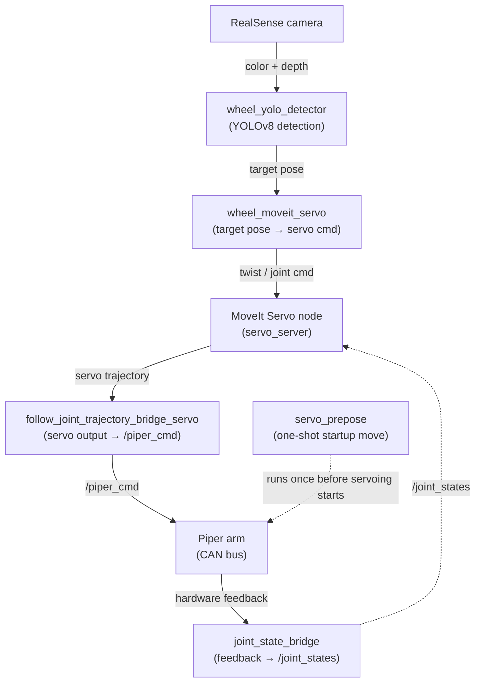

# Piper Arm Visual Servo Demo

A ROS 2 demo that drives an [AgileX Piper](https://github.com/agilexrobotics) 6-DOF arm to visually track and reach toward an object in real time. A RealSense camera feed is run through a YOLOv8 detector to locate a target object (a "wheel" in this demo); the detected 3D pose is fed into MoveIt Servo, which continuously commands the arm's end-effector toward it over CAN.

## How it works



`servo_prepose` runs once at startup to move the arm out of its home/singular position before servoing begins.

## Prerequisites

- Ubuntu 22.04 with ROS 2 Humble
- MoveIt 2 and MoveIt Servo (`moveit_servo`)
- Intel RealSense SDK + `realsense2_camera` (realsense-ros)
- [Ultralytics YOLOv8](https://github.com/ultralytics/ultralytics) (`pip install ultralytics`)
- `can-utils`, and a CAN interface wired to the Piper arm
- The AgileX Piper ROS 2 packages (hardware driver and MoveIt config for the Piper + gripper), built into the same workspace. These are not vendored in this repository — clone them into `src/` alongside `piper_arm_tracking` before building. This demo expects packages named `piper` (driver) and `piper_with_gripper_moveit` (MoveIt config) to be importable from the workspace.

## Workspace setup

```bash
mkdir -p ~/piper_arm_tracking_ws/src
cd ~/piper_arm_tracking_ws/src
# clone this repo's piper_arm_tracking package, plus the Piper driver
# and piper_with_gripper_moveit packages, here

cd ~/piper_arm_tracking_ws
colcon build
source ~/piper_arm_tracking_ws/install/setup.bash
```

The model weights (`yolov8n.pt`) are not committed to this repo. Ultralytics downloads them automatically on first run, or you can fetch them manually:

```bash
python3 -c "from ultralytics import YOLO; YOLO('yolov8n.pt')"
```

## Running the demo

Each step below runs in its own sourced terminal (`source /opt/ros/humble/setup.bash && source ~/piper_arm_tracking_ws/install/setup.bash`).

1. **CAN setup** (power on the arm, plug in the CAN cable):
   ```bash
   sudo ip link set can0 up type can bitrate 1000000
   ```

2. **Start the Piper hardware driver**, bridged so its commands land on `/piper_cmd`:
   ```bash
   ros2 launch piper_arm_tracking start_single_piper_servo.launch.py
   ```

3. **Bridge hardware feedback and servo output**:
   ```bash
   ros2 run piper_arm_tracking joint_state_bridge
   ros2 run piper_arm_tracking follow_joint_trajectory_bridge_servo
   ```

4. **Static transform** between the gripper and camera mount:
   ```bash
   ros2 run tf2_ros static_transform_publisher 0 0 0.10  0 -1.5708 0  gripper_base  camera_link
   ```

5. **Move to the servo-ready pose** (avoids starting in a singularity):
   ```bash
   ros2 run piper_arm_tracking servo_prepose
   ```

6. **Start MoveIt Servo**:
   ```bash
   ros2 launch piper_arm_tracking servo_demo.launch.py
   ros2 service call /servo_server/start_servo std_srvs/srv/Trigger {}
   ```

7. **Start the camera**:
   ```bash
   ros2 launch realsense2_camera rs_launch.py enable_color:=true enable_depth:=true pointcloud.enable:=true align_depth.enable:=true
   ```

8. **Start detection and tracking**:
   ```bash
   ros2 run piper_arm_tracking wheel_yolo_detector
   ros2 run piper_arm_tracking wheel_moveit_servo
   ```

## Repository structure

```
piper-arm-visual-servo-demo/
├── LICENSE
├── README.md
├── .gitignore
└── src/
    └── piper_arm_tracking/              # ROS 2 (ament_python) package
        ├── package.xml
        ├── setup.py
        ├── setup.cfg
        ├── resource/
        │   └── piper_arm_tracking
        ├── config/
        │   └── piper_servo.yaml         # MoveIt Servo parameters
        ├── launch/
        │   ├── start_single_piper_servo.launch.py
        │   └── servo_demo.launch.py
        ├── test/                        # ament lint tests (copyright/flake8/pep257)
        └── piper_arm_tracking/          # Python nodes (see Package contents below)
            ├── joint_state_bridge.py
            ├── follow_joint_trajectory_bridge_servo.py
            ├── servo_prepose.py
            ├── wheel_yolo_detector.py
            ├── wheel_moveit_servo.py
            └── legacy/                  # earlier iterations / debug tools
                ├── follow_joint_trajectory_bridge.py
                ├── wheel_moveit_controller.py
                ├── roi_servo_controller.py
                ├── roi_moveit_controller.py
                ├── roi_moveit_plan_debug.py
                ├── pointcloud_roi_centroid.py
                ├── look_at_target_pose.py
                ├── ik_look_at_controller.py
                ├── ik_look_at_debug.py
                ├── ik_look_at_debug_fixed.py
                ├── simple_motion_node.py
                ├── test_mover.py
                ├── test_mover_angular.py
                ├── testing_node.py
                └── follow_joint_traj_test.py
```

Note: `piper_with_gripper_moveit` and the Piper hardware driver package (`piper`) referenced by the launch files above are external dependencies — see [Prerequisites](#prerequisites) — and are not part of this repository.

## Package contents

### Core pipeline (`src/piper_arm_tracking`)

| Node | Role |
|---|---|
| `joint_state_bridge` | Republishes Piper hardware joint feedback onto `/joint_states` for MoveIt/TF. |
| `follow_joint_trajectory_bridge_servo` | Converts MoveIt Servo's output into `/piper_cmd` hardware commands. |
| `servo_prepose` | One-shot move to a safe, non-singular pose before servoing starts. |
| `wheel_yolo_detector` | Runs YOLOv8 on the RealSense stream, publishes the detected target's 3D point/pose and an RViz marker. |
| `wheel_moveit_servo` | Converts the detected target pose into MoveIt Servo twist/joint commands to track it. |

### Legacy / experimental nodes (`src/piper_arm_tracking/piper_arm_tracking/legacy/`)

Earlier iterations and debug tools from development, kept for reference but not part of the current pipeline above. Their console-script names are unchanged (e.g. `ros2 run piper_arm_tracking roi_moveit_controller` still works); only their location in the package moved.

| Node | Notes |
|---|---|
| `follow_joint_trajectory_bridge` | Non-servo variant of the trajectory bridge (publishes to `/joint_states` instead of `/piper_cmd`). |
| `wheel_moveit_controller` | Direct MoveIt-planning variant of wheel tracking, superseded by `wheel_moveit_servo`. |
| `roi_servo_controller`, `roi_moveit_controller`, `pointcloud_roi_centroid`, `look_at_target_pose` | Earlier point-cloud/ROI-based tracking approach, predates the YOLO detector. |
| `ik_look_at_controller`, `ik_look_at_debug`, `ik_look_at_debug_fixed` | IK-based "look at" controller experiments. |
| `simple_motion_node`, `test_mover`, `test_mover_angular`, `testing_node`, `follow_joint_traj_test`, `roi_moveit_plan_debug` | Manual test/debug scripts used during development. |

### Launch files

- `start_single_piper_servo.launch.py` — starts the Piper hardware driver with its command topics remapped to `/piper_cmd`.
- `servo_demo.launch.py` — loads the Piper URDF/SRDF and starts `robot_state_publisher` and the MoveIt `servo_server`, configured from `config/piper_servo.yaml`.

## License

MIT — see [LICENSE](LICENSE).
